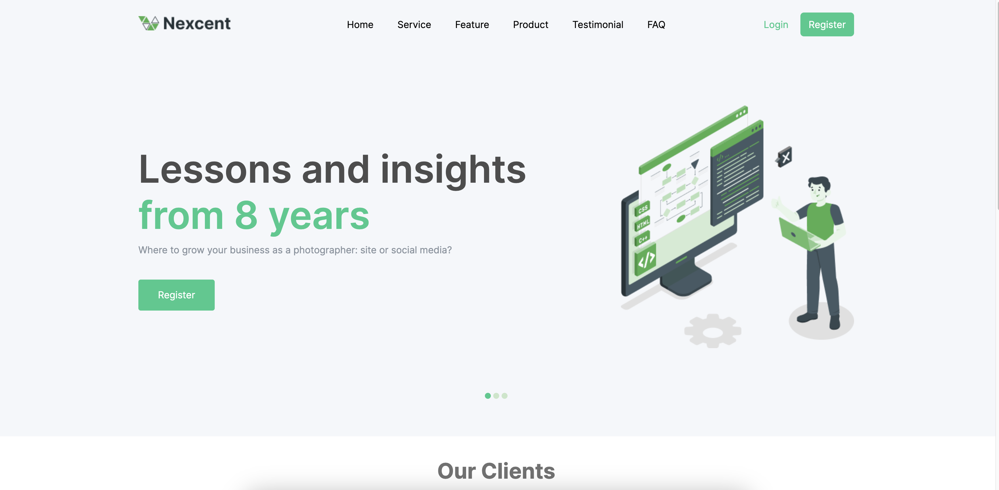
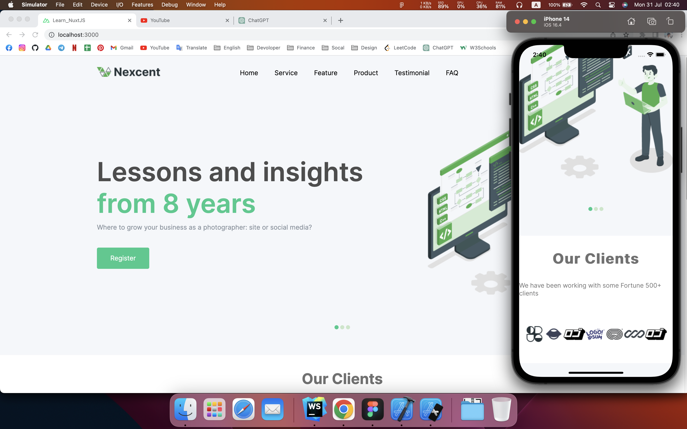
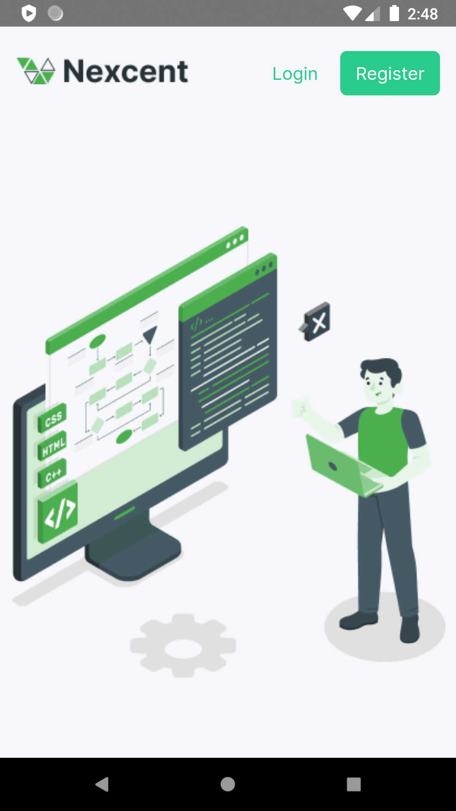

# Learn_NuxtJS


### Participants
Khuong Viet Tai


## Build Setup

```bash
# install dependencies
$ yarn install

# serve with hot reload at localhost:3000
$ yarn dev

# build for production and launch server
$ yarn build
$ yarn start

# generate static project
$ yarn generate
```

### Design

```
https://www.figma.com/file/ilatycC6BCsqfd77d0bV0A/Responsive-Landing-Page-Design?type=design&node-id=0%3A1&mode=design&t=xQ5USy4QC5y8bLsz-1
```

## describe

code written on NuxtJS 2 --version 2.15.8

#### Code languages
Vue

#### mobile

Use Capacitor so the app can build a mobile app.


## demo

#### demo web


#### demo ios



#### demo android 

